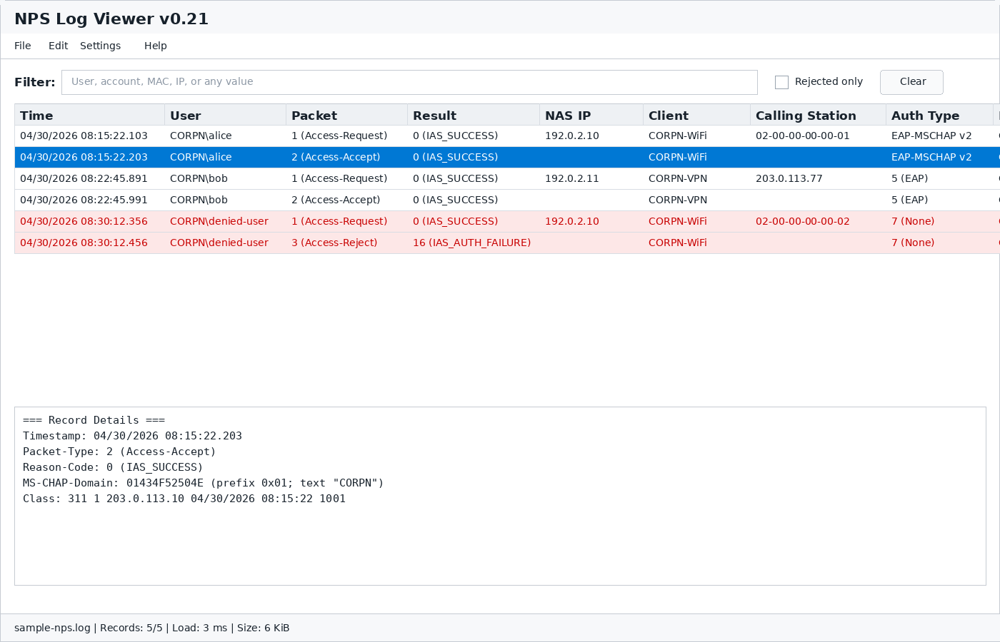
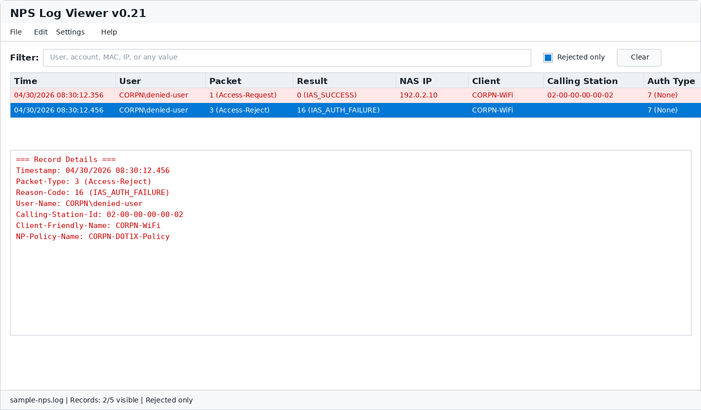
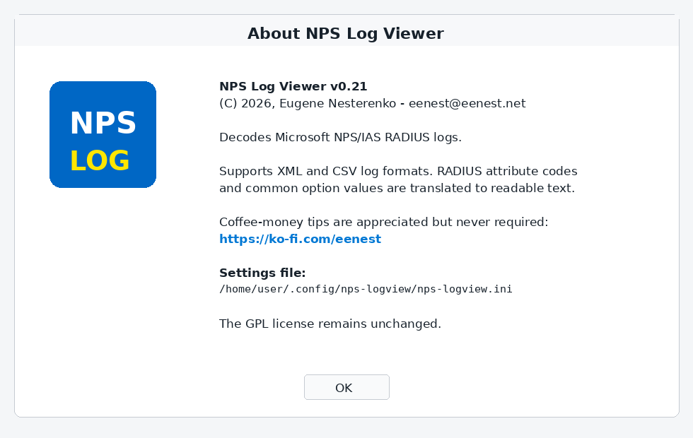
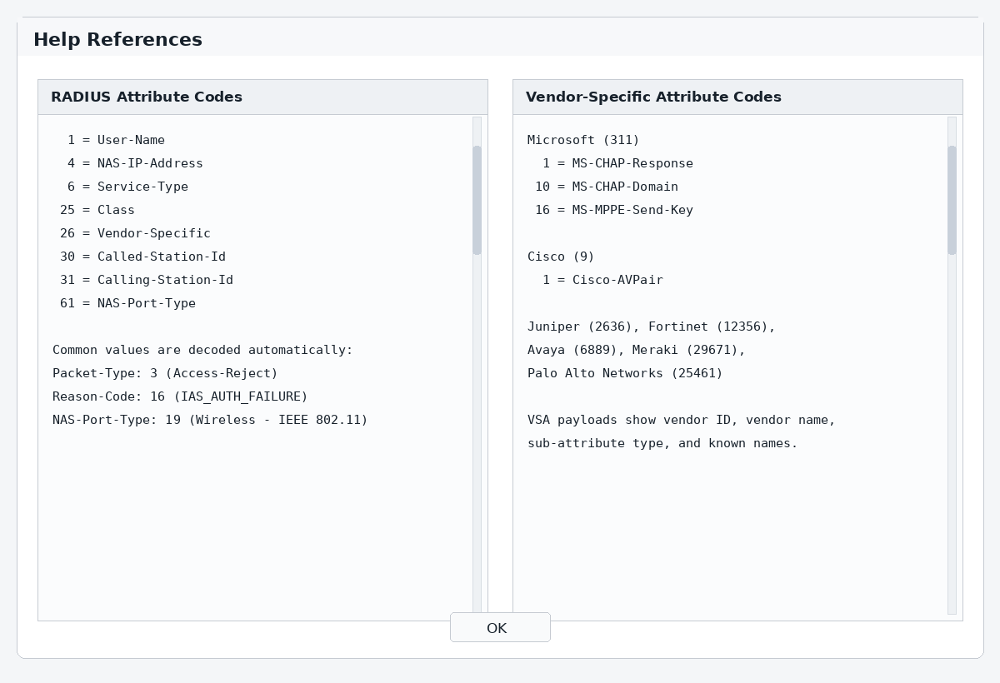

# NPS Log Viewer

A lightweight application for viewing and decoding Microsoft Network Policy Server (NPS) / Internet Authentication Service (IAS) log files.

[Download v0.21](https://github.com/eenest/nps-logview/releases/tag/v0.21)

## Why This Exists

Microsoft NPS logs are useful but painful to read. This viewer decodes common fields, RADIUS attributes, vendor-specific attributes, request/reply pairs, and rejects so Windows and network admins can get to the answer faster.

Runs in three supported app versions:

- **Linux GTK GUI**
- **Windows 64-bit Win32 GUI**
- **Windows 32-bit Win32 GUI**

An optional Linux CLI tool may also be built for viewing logs in a terminal shell and smoke-testing parser changes, but it is not a supported app version.

## Screenshots

These static examples use sanitized sample logs from this repository. No real customer, user, host, IP, or MAC address data is shown.









## Support

NPS Log Viewer is free software. If it helps you troubleshoot NPS/RADIUS logs and saves you time, a coffee-money tip is very appreciated but never required:

[Support the project on Ko-fi](https://ko-fi.com/eenest)

Tips are completely voluntary. They do not unlock features, create a paid license, or change the GPL license. The app remains free to use, share, study, and modify.

See [SUPPORT.md](SUPPORT.md) for the support note included with release packages.

## Features

- **Native Win32 GUI** — no heavy frameworks or runtime dependencies on Windows
- **GTK3 Linux GUI** — native Linux desktop interface with the same features
- **Cross-compiled from Linux** using MinGW-w64 for Windows builds
- **Supports NPS XML log format** — the native format used by Windows Server NPS
- **Also supports CSV/text formats** — database-compatible and IAS formats
- **Decodes RADIUS attribute codes** — numeric option codes are translated to human-readable names
- **Decodes Vendor-Specific Attributes** — hex VSA payloads show Vendor ID, known vendor names, and named sub-attributes for Microsoft, Cisco, Juniper, Fortinet, Avaya, Cisco Meraki, and Palo Alto Networks
- **Includes separate help references** — Help menu entries for standard RADIUS attribute codes and supported Vendor-Specific Attribute codes
- **Voluntary support link** — Help → Support Project opens the Ko-fi coffee-money page; tips are appreciated but never required, and the app remains free software
- **Decodes common binary values** — Microsoft NPS `Class`, selected hex fields such as `MS-CHAP-Domain`, and hex-encoded IPv6 address/prefix attributes are expanded in the CLI and both GUIs
- **Copy record from the list** — right-click a record in the top pane and choose Copy Record, or use the Edit menu / Ctrl+C
- **Pair-aware filtering** — filter by user/account/value or show rejected exchanges while keeping related request/reply records together
- **Rejected exchange highlighting** — if either record in a request/reply exchange is rejected (`Reason-Code` is non-zero), both the request row and reply row are highlighted in red
- **Timestamp header ordering** — clicking the timestamp column toggles the same Most Recent First setting saved in the INI file, while each request/reply exchange still displays request first
- **Column customization** — hide/show columns from Settings → Columns, drag columns to reorder them, and keep widths/order across app runs
- **Export decoded logs** — export the visible decoded records to CSV, plain text, or HTML
- **Improved status bar** — shows file read progress, file name, visible/total record count, load time, file size, and file-change state
- **Streamed file loading** — large logs are parsed from disk without allocating the whole file at once
- **Persistent column widths** — adjusted list column widths are saved and restored across app runs
- **Portable INI settings** — app version metadata, shared recent files/column widths, and per-build window state are stored in a normalized INI file; Help → About shows the actual INI path being used
- **Decodes common enumerated values**:
  - Packet Type (Access-Request, Access-Accept, Accounting-Request, etc.)
  - Service Type (Login, Framed, Administrative, etc.)
  - Framed Protocol (PPP, SLIP, etc.)
  - Accounting Status (Start, Stop, Interim-Update, etc.)
  - NAS Port Type (Ethernet, Wireless 802.11, etc.)
  - Tunnel Type (PPTP, L2TP, VLAN, etc.)
  - Reason Codes (Success, Access Denied, Auth Failure, etc.)
  - Authentication Type (PAP, CHAP, MS-CHAP v2, EAP, PEAP, etc.)
  - EAP Type (TLS, TTLS, PEAP, etc.)
  - And more...
- **Detail pane** — click any record to see fully decoded field values
- **Scrollable RADIUS reference** — Help → RADIUS Attribute Codes opens a compact scrollable reference window

## Download and Run

This release is portable. There is no installer package yet, and the application does not need to be installed.

Choose the package for your system:

| System | Package | How to Run |
|--------|---------|------------|
| Windows 64-bit | `nps-logview-v0.21-windows-x64.zip` | Unzip, then run `nps-logview.exe` |
| Windows 32-bit | `nps-logview-v0.21-windows-x86.zip` | Unzip, then run `nps-logview-x86.exe` |
| Linux x86_64 | `nps-logview-v0.21-linux-x86_64.tar.gz` | Extract, then run `./nps-logview` |
| Source code | `nps-logview-v0.21-source.tar.gz` | Build from source using the commands below |

Each binary package includes sanitized sample logs under `logs/`, so you can test the viewer immediately without using real NPS data.

### Windows

1. Download the Windows package that matches your system.
2. Extract the `.zip` file to a normal folder, for example `Downloads\NPS-Log-Viewer`.
3. Run `nps-logview.exe` for 64-bit Windows or `nps-logview-x86.exe` for 32-bit Windows.
4. Use **File → Open** to load a `.log`, `.txt`, or `.csv` NPS/IAS log file.

The Windows binaries are unsigned for this release. Windows SmartScreen may show a warning the first time you run the app. The application is portable and does not write to the Windows registry.

### Linux

1. Download `nps-logview-v0.21-linux-x86_64.tar.gz`.
2. Extract it:

```bash
tar -xzf nps-logview-v0.21-linux-x86_64.tar.gz
cd nps-logview-v0.21-linux-x86_64
```

3. Run it:

```bash
./nps-logview
```

If the app does not start because GTK3 is missing, install the GTK3 runtime package for your distribution. On Ubuntu, Debian, or Linux Mint:

```bash
sudo apt install libgtk-3-0
```

The Linux binary is built on Linux Mint/Ubuntu-style systems. For other Linux distributions, building from source may be more reliable.

## Settings File

NPS Log Viewer stores preferences in `nps-logview.ini`. This file contains app version metadata, recent files, column widths/order/visibility, the Most Recent First setting, and window state.

The app uses one INI file per run. It does not merge settings from multiple locations. The exact resolved INI path is shown in **Help -> About**.

Placement rules:

1. The app finds the folder where the running executable is located.
2. It tests whether that folder is writable by creating and removing a temporary `.writetest` file.
3. If the executable folder is writable, the app uses `nps-logview.ini` in that same folder. This is the portable mode and has priority over all fallback locations.
4. If the executable folder is not writable, the app uses the per-user fallback location for the current system.
5. If you move the executable to another writable folder, that folder will get its own portable `nps-logview.ini`. To keep the same settings, move the INI file with the executable or use the per-user fallback location.

| System | Preferred Portable Location | Fallback Per-User Location |
|--------|-----------------------------|----------------------------|
| Windows 64-bit / 32-bit | Same folder as `nps-logview.exe` or `nps-logview-x86.exe`: `nps-logview.ini` | `%LOCALAPPDATA%\nps-logview\nps-logview.ini`; if `LOCALAPPDATA` is unavailable, `%APPDATA%\nps-logview\nps-logview.ini` |
| Linux GTK | Same folder as `./nps-logview`: `nps-logview.ini` | `$HOME/.config/nps-logview/nps-logview.ini` |

On Windows, if neither `LOCALAPPDATA` nor `APPDATA` is available, the app falls back to `.\nps-logview\nps-logview.ini`. On Linux, if `HOME` is not available, the app falls back to `./.config/nps-logview/nps-logview.ini`.

If you extract the app to a writable folder such as Downloads or your home directory, the INI usually stays beside the executable. If you place it somewhere protected, such as `Program Files` on Windows or a system-owned directory on Linux, the per-user fallback is used.

Windows 64-bit, Windows 32-bit, and Linux can share one INI file safely. Build-specific window placement is stored in separate sections: `[window.win64]`, `[window.win32]`, and `[window.gtk]`. Shared settings such as recent files, column layout, and Most Recent First are stored in shared sections such as `[recent]`, `[columns]`, `[columns.hidden]`, and `[settings]`.

To reset preferences, close the app and remove or rename `nps-logview.ini` from the location shown in **Help -> About**.

## Building

### Prerequisites

- **Linux CLI terminal viewer**: `gcc`, `make`
- **Linux GUI**: `gcc`, `make`, `libgtk-3-dev`
- **Windows cross-compile**: `mingw-w64`

On Ubuntu/Debian/Linux Mint:
```bash
sudo apt install build-essential mingw-w64 libgtk-3-dev
```

### Build Targets

```bash
# Linux GTK3 GUI app version
make linux

# Linux GTK3 GUI app version (alias)
make linux-gui

# Windows 64-bit GUI app version
make windows

# Windows 32-bit GUI app version
make win32

# Optional terminal viewer/parser smoke-test
make cli

# Release app build/check: build all three supported app versions
make linux
make windows
make win32

# Clean build artifacts
make clean
```

For release-quality changes, keep the Windows and Linux GUI implementations at the same functionality level and build all three supported app versions: Linux GTK GUI, Windows 64-bit GUI, and Windows 32-bit GUI. If a local toolchain is missing, record which version could not be built. The CLI is useful for terminal log viewing and parser smoke testing through `make cli` or `make test`, but it is not part of GUI parity.

### Run Linux CLI Terminal Viewer

```bash
# Build the optional terminal viewer
make cli

# Test with the small synthetic sample log
./nps-logview-cli logs/sample-nps.log

# Test with larger anonymized realistic NPS XML logs
./nps-logview-cli logs/sample-IN260429.log
./nps-logview-cli logs/sample-IN260430.log

# Test with your own NPS XML logs
./nps-logview-cli /path/to/your-nps.log
```

## Project Structure

```
src/
  radius_dict.h   — RADIUS attribute code and VSA decoder declarations
  radius_dict.c   — Attribute name, Vendor-Specific, and value decoders
  compat.h        — C compatibility helpers
  parser.h        — NPS log parser interface
  parser.c        — XML, CSV, and IAS format parser
  nps_gui.c       — Win32 GUI application
  nps_gui_linux.c — GTK3 Linux GUI application
  cli_test.c      — Optional Linux CLI terminal viewer/test harness
logs/
  sample-nps.log       — Small synthetic NPS XML log
  sample-IN260429.log  — Larger anonymized realistic NPS XML test log
  sample-IN260430.log  — Larger anonymized realistic NPS XML test log
Makefile
```

## Opening Remote NPS Logs

NPS Log Viewer can open log files over a normal Windows file share. This is often the most convenient way to review NPS logs from an admin workstation without copying the viewer to the NPS server.

Recommended approach:

1. Share the NPS log directory from the Windows NPS server.
2. Grant read-only access to the administrators or troubleshooting account that will view logs.
3. Open the shared `.log` file from NPS Log Viewer on Windows or Linux.

The default NPS/IAS log directory is commonly:

```text
C:\Windows\System32\LogFiles
```

Confirm the actual path on the NPS server in the NPS console under **Accounting** because the log location can be customized.

### Share the Folder on Windows Server

Use Windows Explorer:

1. Open the NPS log folder, for example `C:\Windows\System32\LogFiles`.
2. Right-click the folder and choose **Properties**.
3. Open the **Sharing** tab.
4. Click **Advanced Sharing**.
5. Enable **Share this folder**.
6. Use a clear share name such as `NPSLogs`.
7. Set share permissions to read-only for the users or group that should view logs.
8. Confirm NTFS permissions also allow read access.

PowerShell example, run from an elevated PowerShell prompt on the NPS server:

```powershell
New-SmbShare -Name NPSLogs -Path "C:\Windows\System32\LogFiles" -ReadAccess "DOMAIN\NPS Log Readers"
```

Replace `DOMAIN\NPS Log Readers` with the domain group or user that should be allowed to read the logs.

### Open from Windows

From a Windows workstation, use **File → Open** and enter a UNC path such as:

```text
\\nps-server\NPSLogs
```

Then select the required `.log` file.

You can also map the share to a drive letter if preferred:

```cmd
net use Z: \\nps-server\NPSLogs
```

Then open files from `Z:\`.

### Open from Linux

Linux can access the same SMB share either through the desktop file manager or by mounting it.

On many GTK desktops, opening the share in the file manager is enough:

```text
smb://nps-server/NPSLogs
```

If the file chooser does not expose the SMB location directly, mount the share first:

```bash
sudo mkdir -p /mnt/npslogs
sudo mount -t cifs //nps-server/NPSLogs /mnt/npslogs -o username=YOUR_USER,domain=YOUR_DOMAIN,ro
```

Then open the log from:

```text
/mnt/npslogs
```

Install CIFS support if the `mount.cifs` helper is missing:

```bash
sudo apt install cifs-utils
```

### Remote Log Notes

- Use read-only sharing. NPS Log Viewer only needs to read the log files.
- Large files are streamed, so remote files do not need to be copied first.
- If Windows reports that a live log is locked, copy the log file to another shared folder and open the copy.
- If a log is actively changing while open, the status bar will report that the file changed.

## Log Format Support

| Format | Example Extension | Description |
|--------|-------------------|-------------|
| NPS XML | `.log` | Native Windows Server NPS format with `<Event>` tags (primary format) |
| Database CSV | `.csv`, `.log` | Comma-separated with quoted fields |
| IAS Text | `.log`, `.txt` | Space or tab delimited legacy format |

### NPS XML

The primary supported format is the Windows Server NPS/IAS XML event format, where each log record is one `<Event>...</Event>` entry. The parser auto-detects XML when the file begins with `<?xml` or `<Event` after leading whitespace.

Each child tag inside `<Event>` becomes a field name. For example:

```xml
<Timestamp>04/30/2026 09:04:24.984</Timestamp>
<User-Name>CORPN\alice</User-Name>
<Packet-Type>1</Packet-Type>
<Reason-Code>0</Reason-Code>
```

These become the `Timestamp`, `User-Name`, `Packet-Type`, and `Reason-Code` columns/fields in the viewer. XML tag attributes such as `data_type` are ignored; the tag text is used as the field value.

The bundled sample logs use only synthetic or anonymized values. `CORPN` is the fictional company name used in sample accounts, hosts, policies, clients, and SSIDs. `logs/sample-nps.log` is a small hand-written sample; `logs/sample-IN260429.log` and `logs/sample-IN260430.log` are larger realistic test logs generated from private captures after replacing users, domains, host names, client names, IP addresses, MAC addresses, session IDs, policies, and embedded Vendor-Specific strings.

Common NPS fields used by the GUI include:

| Field | Purpose |
|-------|---------|
| `Timestamp` | Event time; clicking this column toggles Most Recent First ordering |
| `User-Name`, `SAM-Account-Name`, `Fully-Qualifed-User-Name` | User/account values used by filtering |
| `Packet-Type` | RADIUS packet type, such as Access-Request, Access-Accept, or Access-Reject |
| `Reason-Code` | NPS result code; non-zero values indicate failure/rejection |
| `Acct-Session-Id` | Session identifier, used as a fallback pairing key |
| `Class` | Microsoft NPS class value; preferred request/reply pairing key when present |
| `Calling-Station-Id` | Client MAC/IP/calling station value |
| `Client-Friendly-Name` | NPS client display name |
| `NAS-IP-Address`, `NAS-Identifier` | Network access server fields |
| `Authentication-Type`, `EAP-Friendly-Name` | Authentication method fields |
| `Vendor-Specific` | Hex-encoded Vendor-Specific Attribute payload |

### CSV and Text

CSV/text files are parsed line by line. The parser supports comma-separated and tab-separated fields, quoted CSV values, and escaped quotes (`""`) inside quoted values.

For CSV-like files, the first row is treated as a header only when most fields look like names rather than data. Rows beginning with NPS/IAS data markers such as `NPAS`, `NPS`, or `IAS` are treated as data, not headers. If no header is detected, the viewer falls back to generic field names.

### Decoding Behavior

The detail pane, exports, and visible columns use the shared decoder. It expands common numeric and binary values, including:

- RADIUS packet, service, tunnel, NAS port, authentication, EAP, accounting, and reason codes
- Standard RADIUS attribute names
- Vendor-Specific Attributes for Microsoft, Cisco, Juniper, Fortinet, Avaya, Meraki, and Palo Alto Networks
- Microsoft NPS `Class` values
- selected hex fields such as `MS-CHAP-Domain`
- hex-encoded IPv6 address and prefix fields

### Request/Reply Pairing

Filtering, rejected highlighting, and most-recent-first ordering are request/reply aware. When `Class` exists on both records, it is the preferred pairing key. `Acct-Session-Id` is only used as a fallback when `Class` is missing, and matching timestamps are used when available to avoid grouping separate authentications that reused the same session ID.

Within a pair or exchange group, Access-Request records are displayed before reply records even when Most Recent First is enabled.

Station/MAC filtering accepts common formats interchangeably for calling/called station IDs, including Windows style (`AA-BB-CC-DD-EE-FF`), standard colon style (`aa:bb:cc:dd:ee:ff`), and Cisco style (`aabb.ccdd.eeff`).

### Limits

- GUI file loading rejects empty files, but reads non-empty files as a stream instead of allocating the whole file.
- Up to 4,096 records are loaded per file.
- Up to 64 fields are stored per record.
- Each field value is capped at 512 characters.
- Each XML field name is capped at 64 characters.
- Stored raw record text is capped at 8,192 characters per record for memory safety.
- Each physical input line is capped at 8 MiB while reading. If a line is longer, the parser keeps the capped prefix, discards the rest of that line, and continues with the next line.
- Malformed, partial, binary, or otherwise garbage input should fail gracefully by loading only parseable records or no records; it should not crash the application.
